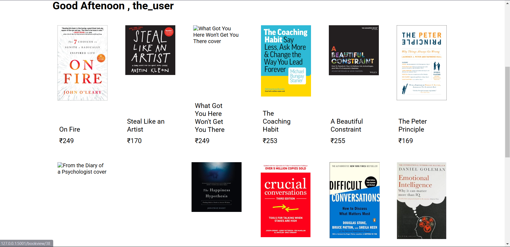

# WisdomManuals

A flask web application that sells books. 

## Features

- User authentication
- Pagination
- Responsive
- Payment processing


## Tech Stack

**Frontend:** HTML, CSS, Javascript

**Backend:** Flask (python), SQLite (database)


## Required Variables

To run this project, you need the following variables in theire corresponding files

#### In sub.py

`google_books_api_key` : Google books api key

#### In app.py

`my_email` : email id used to send email after an order

`pwd` : above email's password

`RAZOR_TEST` : Razorpay's test key from its dashboard

`RAZOR_API` : Razorpay's api key

#### In bookdatascraper/main.py

`CHROME_WEB_DRIVER_PATH` : Chrome web driver's (.exe) path


## Installation

Install the required packages using `pip`

```bash
    > pip install -r requirements.txt
```


## Relational Database


<details><summary><h3>Database schema</h3></summary>


</details>


    
## Screenshots

(for more see 'ss' directory)

<details><summary>Home page</summary>


</details>

<details><summary>Books display page</summary>



</details>

<details><summary>Register page</summary>


</details>

<details><summary>Cart page</summary>


</details>
